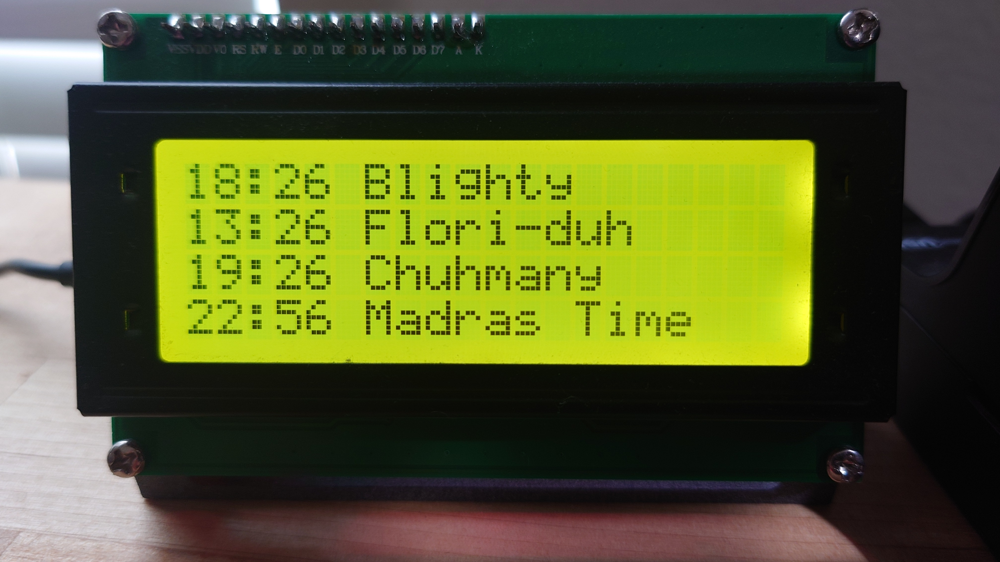

ESPHome World Clock

World Clock

This project utilizes ESPHome to create a world clock that displays the time from different time zones on an LCD screen. Each time zone is represented with its corresponding time and customised (spelled correctly) location name.
Hardware Requirements

    ESP32 development board (e.g., LOLIN32)
    LCD display with PCF8574 I2C backpack

Installation

    Clone or download this repository to your local machine.
    Copy the contents of the world-clock directory into your ESPHome project directory.
    Make sure to have the necessary hardware components connected to your ESP32 board as per the configuration in world-clock.yaml.

Configuration

    Update the world-clock.yaml file to match your specific setup.
    Modify the time platform to configure your desired time zone settings.
    Ensure that the font and display sections are correctly configured for your LCD display.

Usage

    Flash the ESPHome firmware to your ESP32 board using the provided configuration.
    Once flashed, the ESP32 board will automatically connect to the specified WiFi network.
    The LCD display will start showing the time from different time zones as per the configuration.
    You can further customize the display or functionality by modifying the ESPHome YAML configuration file.

The finished product

License

This project is licensed under the MIT License.